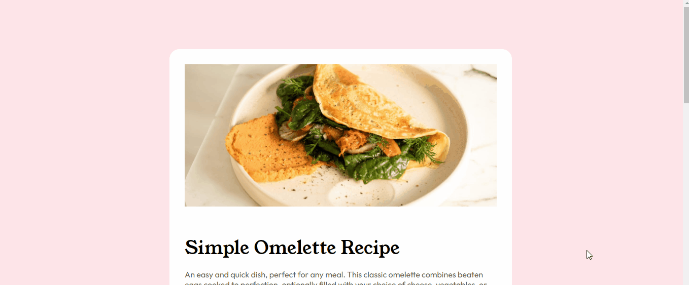

# Frontend Mentor - Recipe page

This is a solution to the [Recipe page challenge on Frontend Mentor](https://www.frontendmentor.io/challenges/recipe-page-KiTsR8QQKm). Frontend Mentor challenges help you improve your coding skills by building realistic projects. 

## Índice

- [Overview](#overview)
  - [Gif](#gif)
  - [Links](#links)
- [Meu processo](#meu-processo)
  - [Desenvolvido com](#desenvolvido-com)
  - [O que aprendi](#O-que-aprendi)
  - [Desenvolvimento contínuo](#desenvolvimento-contínuo)
- [Autor](#autor)

## Overview

### Gif

### Links

- Solution URL: [https://github.com/ryaansouza/challenge-recipe-page](https://github.com/ryaansouza/challenge-recipe-page)
- Live Site URL: [https://ryaansouza.github.io/challenge-recipe-page/](https://ryaansouza.github.io/challenge-recipe-page/)

## Meu processo

### Desenvolvido com

- Semantic HTML5 markup
- CSS custom properties
- Flexbox
- Mobile-first workflow
- [Styled Components](https://styled-components.com/) - For styles

### O que aprendi

Aprendi novas formas de estilizar tabelas, e novas propriedades para se usar em listas.

Alem de reforçar o uso de varias propriedades CSS com qual não tenho muita familiaridade.

### Desenvolvimento contínuo

Planejo continuar reforçando conceitos como Mobile First, reforçar meus conhecimentos nas propriedades CSS, e me aprimorar cade vez mais no desenvolvimento de um codigo limpo.

## Autor

- Linkedin - [Ryan Souza](https://www.linkedin.com/in/ryaansouza/)
